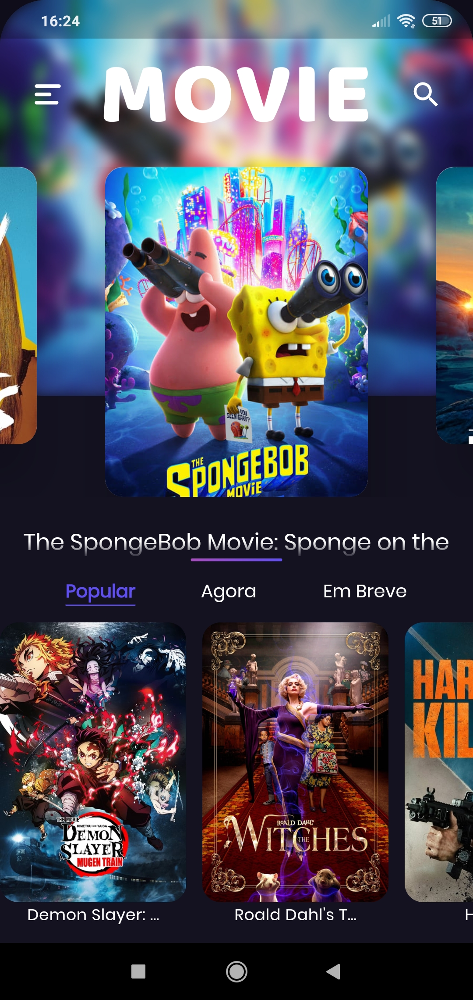
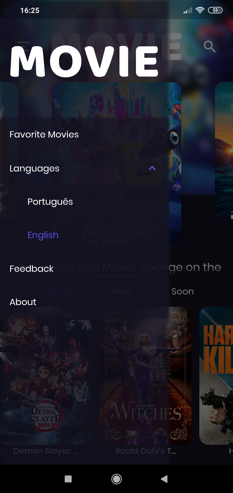

# Flutter Movies App

An application made with Flutter to practice the principles of Clean Architecture.  
Even being focused on architecture, the project also has a beautiful UI.

  
  

  
  

## Getting Started

Note: You already need to have Flutter installed.

<pre>
# clone the repo
git clone https://github.com/marciovalim/flutter-movies-app.git 

# move to the cloned repo
cd flutter-movies-app

# get dependencies
flutter pub get

# run application
flutter run
</pre>

## 📝 License

This project is under MIT License. See <a href="https://github.com/marciovalim/flutter-movies-app/blob/master/LICENSE">LICENSE</a> for more details.

## Thanks to

- [unclebob](https://github.com/unclebob) (For the infamous Clean Architecture)
- [techieblossom](https://github.com/TechieBlossom) (For the awesome youtube tutorials)
- Authors of all the packages I have used, who made our lives easier.
